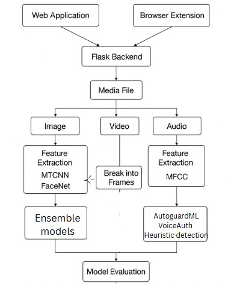

# Media File Processing and Deepfake Detection System

## Overview

Deployed Website - https://deep-scan-xfla.vercel.app/

This project provides a robust pipeline for detecting **deepfake content** in **images**, **videos**, and **audio** files. By utilizing multiple machine learning models and advanced feature extraction techniques, the system can identify tampered media with high accuracy. The project integrates a **Web Application**, a **Browser Extension**, and a **Flask Backend** for easy user interaction, server-side processing, and efficient feature extraction.

The goal of this system is to detect deepfake content in various media types to help mitigate the spread of misleading or harmful media. The ensemble models in this system combine several machine learning algorithms to maximize detection accuracy.

---

## System Architecture

The architecture of the system is as follows:

The system is composed of the following components:

1. **Web Application (Next.js)**: A user-friendly frontend that allows users to upload media files and view results.
2. **Browser Extension**: Provides seamless media file processing directly from the user's browser, making it easy for users to test media files without leaving their current web pages.
3. **Flask Backend**: The backend that handles all processing tasks, such as media file reception, feature extraction, and interaction with machine learning models.
4. **Feature Extraction**:
   - **Image Processing**: Uses MTCNN and FaceNet to extract features from images.
   - **Video Processing**: Breaks videos into individual frames and processes each frame using the same techniques as images.
   - **Audio Processing**: Extracts features from audio using MFCC (Mel-frequency cepstral coefficients).
5. **Machine Learning Models**:
   - **Ensemble Models** (Random Forest, SVM, XGBoost) are used for predictions.
6. **Model Evaluation**: After feature extraction, the models classify the media files as real or tampered, and the results are provided to the user.

---

## Results

### Image/Video Models:
1. **Random Forest**:  
   - **Accuracy**: 86%  
   - Random Forest model used for image and video deepfake detection achieved an accuracy of 86%.

2. **Random Forest with Augmented Data**:  
   - **Accuracy**: 91%  
   - Augmenting the training data improved the model's accuracy to 91%.

3. **Random Forest with Augmented Data + Hyperparameter Tuning**:  
   - **Accuracy**: 91.5%  
   - Hyperparameter tuning slightly improved the accuracy to 91.5%.

4. **Support Vector Machine (SVM)**:  
   - **Accuracy**: 88%  
   - SVM achieved an accuracy of 88%, showing reliable performance for image/video data.

5. **XGBoost**:  
   - **Accuracy**: 93%  
   - XGBoost outperformed Random Forest and SVM with an accuracy of 93%.

6. **Ensemble Model (Soft Voting)**:  
   - **Accuracy**: 94%  
   - The Ensemble model using soft voting achieved an accuracy of 94%.

7. **Ensemble Model (Hard Voting)**:  
   - **Accuracy**: 94%  
   - The hard voting ensemble model performed similarly, with a 94% accuracy.

8. **Ensemble Model (Stacking)**:  
   - **Accuracy**: 95.5%  
   - The Stacking Ensemble model achieved the highest accuracy of 95.5%, showing the power of stacking.

---

### Audio Models:
1. **VoiceAuth ML**:  
   - **Accuracy**: 90.7%  
   - The VoiceAuth ML model for audio-based deepfake detection achieved 90.7% accuracy.

2. **Audio Guard ML**:  
   - **Accuracy**: 92.5%  
   - Audio Guard ML outperformed VoiceAuth ML with an accuracy of 92.5%.

3. **VoiceAuth ML + Audio Guard ML + Heuristic Detection**:  
   - **Accuracy**: 94%  
   - Combining VoiceAuth ML, Audio Guard ML, and heuristic methods led to an accuracy of 94%.

---

### Phishing Website Detection:
1. **Random Forest**:  
   - **Accuracy**: 90.5%  
   - For phishing website detection, the Random Forest model achieved an accuracy of 90.5%, effectively detecting phishing attempts.

---

### Conclusion:
- **Overall Best Performance**: The **Ensemble Model (Stacking)** achieved the highest accuracy (95.5%) in the image/video models section, while the combination of **VoiceAuth ML + Audio Guard ML + Heuristic Detection** yielded the highest performance in audio detection (94%).
- **General Insights**: Combining multiple models (ensemble methods) led to significant performance improvements. Both image/video and audio models benefitted from ensemble techniques, confirming that using various algorithms together yields better results than single models alone.

---

## Objective

The objective of this project is to build a comprehensive and reliable system for detecting **deepfakes** in different media formats (images, videos, and audio). The system is designed to be scalable, efficient, and easy to use, making it suitable for real-time applications like social media monitoring, media verification, and law enforcement tools.

By integrating both **client-side** and **server-side** processing, the system offers a seamless user experience while ensuring accurate and fast predictions.

---

## Tech Stack Used

### 🖥️ Frontend
- **Chrome Extension**: JavaScript, HTML, CSS
- **Web App**: React (Next.js), Tailwind CSS, Shadcn/UI

### 🧠 Client-Side ML
- **Pyodide**: Python in the browser via WebAssembly for media preprocessing.

### 🔧 Backend
- **Flask**: Hosts Python microservices running deepfake detection models (Random Forest, SVM, XGBoost).
- **Inference**: API calls made to Flask for model inference.

### 📡 Inference
- **API Calls**: API calls made to models hosted on **Hugging Face Spaces**.

### 🖼️ Media Preprocessing
- **In-browser**: Pyodide + Pillow
- **Server-side (Quantized Model)**: OpenCV, NumPy

### 🗃️ Storage
- **Chrome Extension**: Supabase
- **Web App**: Cloud storage via **Supabase**.

### 🔐 Communication
- **Secure transmission via HTTPS**.
- **JSON-based API** for media and result exchange.

---

## Why ML Models Over Deep Learning?

- **Faster training and inference** compared to deepfake-specific models.
- **Generalizes better** across different datasets (real, deepfake, AI-generated).
- **Efficient use of pre-extracted features** like FaceNet or CLIP embeddings.
- **No need for specialized hardware**, making them computationally lighter.
- **Easier interpretability** and understanding of model decisions.
- **Requires less data** to perform well compared to deepfake models.
- **Scalable and reusable**, without the need for constant retraining.
- **Flexible integration** with pre-trained feature extractors like FaceNet and CLIP.
- **Adapts better** to data variations like resolution or lighting changes.

---